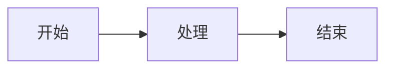

# Woodlin 项目文档

这是 Woodlin 多租户中后台管理系统的完整文档，使用 VuePress Theme Hope v2 构建。

## 🌟 特性

- ✅ **VuePress Theme Hope v2**：功能强大的 VuePress 主题，专为中文用户优化
- ✅ **中文字体优化**：使用 LXGW WenKai（霞鹜文楷）字体，阅读体验更佳
- ✅ **代码高亮增强**：支持多种编程语言，包括 Java、TypeScript、Vue、LaTeX 等
- ✅ **代码组功能**：支持多标签页代码展示，方便比较不同实现
- ✅ **响应式设计**：完美支持移动端和桌面端，自适应各种屏幕
- ✅ **全文搜索增强**：强大的 SearchPro 插件，支持自定义字段搜索
- ✅ **Markdown 增强**：支持提示容器、任务列表、图表、数学公式等丰富功能
- ✅ **详尽完整**：每个模块都有详细的文档说明和代码示例

## 📚 文档结构

```
documentation/
├── docs/
│   ├── .vuepress/           # VuePress 配置
│   │   ├── config.ts        # 主配置文件
│   │   ├── client.ts        # 客户端配置
│   │   └── styles/          # 自定义样式
│   │       ├── index.scss   # 自定义样式（中文字体配置）
│   │       └── palette.scss # 主题颜色配置
│   ├── index.md             # 首页
│   ├── guide/               # 指南
│   │   ├── introduction.md  # 项目介绍
│   │   ├── getting-started.md  # 快速开始
│   │   ├── architecture.md  # 技术架构
│   │   ├── directory-structure.md  # 目录结构
│   │   └── configuration.md  # 配置说明
│   ├── modules/             # 模块文档
│   │   ├── overview.md      # 模块总览
│   │   ├── dependencies.md  # 依赖管理模块
│   │   ├── common.md        # 通用模块
│   │   ├── security.md      # 安全认证模块
│   │   ├── system.md        # 系统管理模块
│   │   ├── tenant.md        # 多租户模块
│   │   ├── file.md          # 文件管理模块
│   │   ├── task.md          # 任务调度模块
│   │   ├── generator.md     # 代码生成模块
│   │   ├── sql2api.md       # SQL2API 模块
│   │   ├── admin.md         # 管理后台模块
│   │   └── web.md           # 前端应用模块
│   ├── development/         # 开发指南
│   │   ├── code-style.md    # 代码规范
│   │   ├── environment-setup.md  # 环境搭建
│   │   ├── debugging.md     # 调试技巧
│   │   ├── testing.md       # 测试指南
│   │   ├── commit-convention.md  # 提交规范
│   │   ├── contributing.md  # 贡献指南
│   │   ├── custom-module.md  # 自定义模块
│   │   ├── extension.md     # 扩展开发
│   │   └── performance.md   # 性能优化
│   ├── deployment/          # 部署指南
│   │   ├── overview.md      # 部署概览
│   │   ├── local.md         # 本地部署
│   │   ├── docker.md        # Docker 部署
│   │   ├── kubernetes.md    # K8s 部署
│   │   ├── production.md    # 生产环境
│   │   └── monitoring.md    # 监控运维
│   └── api/                 # API 文档
│       ├── overview.md      # API 概览
│       ├── authentication.md  # 认证授权
│       ├── system.md        # 系统管理 API
│       ├── user.md          # 用户管理 API
│       ├── role.md          # 角色权限 API
│       ├── tenant.md        # 租户管理 API
│       ├── file.md          # 文件管理 API
│       ├── task.md          # 任务调度 API
│       └── sql2api.md       # SQL2API
├── package.json             # 项目配置
└── README.md                # 本文件
```

## 🚀 快速开始

### 安装依赖

```bash
npm install
```

### 开发模式

启动开发服务器，支持热重载：

```bash
npm run docs:dev
```

访问 http://localhost:5173 查看文档。

### 构建生产版本

构建静态站点：

```bash
npm run docs:build
```

构建产物位于 `docs/.vitepress/dist/` 目录。

### 预览生产版本

预览构建后的站点：

```bash
npm run docs:preview
```

## 📝 编写文档

### Markdown 扩展

VuePress Theme Hope 支持强大的 Markdown 扩展功能：

#### 1. 代码块高亮

支持多种编程语言，包括 Java、TypeScript、Vue、LaTeX 等，并支持行号和高亮：

````markdown
```java
public class Example {
    public static void main(String[] args) {
        System.out.println("Hello, Woodlin!");
    }
}
```

```latex
\begin{equation}
E = mc^2
\end{equation}
```
````

#### 2. 代码标签页（Code Tabs）

使用代码标签页展示不同语言或不同方案的实现：

`````markdown
::: code-tabs#shell

@tab Maven

```bash
mvn clean package
```

@tab Gradle

```bash
gradle build
```

@tab npm

```bash
npm run build
```

:::
`````

#### 3. 自定义容器

```markdown
::: tip 提示
这是一个提示框，用于提供有用的信息
:::

::: warning 警告
这是一个警告框，提醒用户注意
:::

::: danger 危险
这是一个危险框，警告严重问题
:::

::: info 信息
这是一个信息框，展示一般信息
:::

::: note 注意
这是一个注释框
:::

::: important 重要
这是一个重要信息框
:::
```

#### 4. 表格

```markdown
| 列1 | 列2 | 列3 |
|-----|-----|-----|
| 值1 | 值2 | 值3 |
```

#### 5. 任务列表

```markdown
- [x] 完成的任务
- [ ] 未完成的任务
```

#### 6. 数学公式（KaTeX）

```markdown
行内公式：$E = mc^2$

块级公式：

$$
\frac{1}{n} \sum_{i=1}^{n} x_i
$$
```

#### 7. 图表（Mermaid）

````markdown

````

#### 8. 徽章和卡片

```markdown
<Badge text="新功能" type="tip" />
<Badge text="已废弃" type="warning" />
<Badge text="重要" type="danger" />
```

### 文档编写规范

1. **文件命名**：使用小写字母和连字符，如 `getting-started.md`
2. **标题层级**：从 h1 开始，不要跳级
3. **代码示例**：提供完整的、可运行的代码示例
4. **中文排版**：遵循中文排版规范，标点符号使用正确
5. **链接检查**：确保所有内部链接有效
6. **图片资源**：放在 `docs/public/images/` 目录下

### 中文字体配置

文档配置了完整的中文字体回退链，确保在各种环境下都能正确显示中文：

**字体优先级**：
1. **LXGW WenKai（霞鹜文楷）** - 优先使用，通过 CDN 加载（如果可用）
2. **系统中文字体** - 自动使用系统内置的中文字体
   - macOS: PingFang SC, Hiragino Sans GB, Heiti SC
   - Windows: Microsoft YaHei (微软雅黑), SimSun (宋体)
   - Linux: WenQuanYi Micro Hei, Noto Sans CJK SC

**字体说明**：
- **正文字体**：LXGW WenKai Screen - 优雅的中文字体，适合正文阅读
- **代码字体**：LXGW Bright Code - 专为代码显示设计的等宽字体

**配置位置**：`docs/.vuepress/styles/index.scss`

**注意事项**：
- 字体通过 CDN 自动加载，但在某些环境下可能被拦截
- 即使 CDN 字体加载失败，系统内置字体也能保证中文正常显示
- 在 Linux 环境下，如果需要最佳显示效果，建议安装中文字体包：
  ```bash
  # Ubuntu/Debian
  sudo apt-get install fonts-wqy-zenhei fonts-wqy-microhei
  
  # CentOS/RHEL
  sudo yum install wqy-zenhei-fonts wqy-microhei-fonts
  ```

## 🎨 主题定制

### 修改主题颜色

编辑 `docs/.vuepress/styles/palette.scss`，修改 SCSS 变量：

```scss
/* 主题色 */
$theme-color: #646cff;
$theme-color-light: #747bff;

/* 响应式断点 */
$mobile: 768px;
$tablet: 959px;
$pad: 1280px;
$desktop: 1440px;
```

### 修改自定义样式

编辑 `docs/.vuepress/styles/index.scss`，添加自定义样式：

```scss
/* 自定义样式 */
.theme-hope-content {
  /* 你的样式 */
}
```

### 修改配置

编辑 `docs/.vuepress/config.ts`，自定义站点配置：

```typescript
import { defineUserConfig } from "vuepress"
import { hopeTheme } from "vuepress-theme-hope"

export default defineUserConfig({
  theme: hopeTheme({
    // 主题配置选项
    plugins: {
      mdEnhance: {
        // Markdown 增强配置
      },
    },
  }),
})
```

## 📖 参考资源

- [VuePress 官方文档](https://vuejs.press/zh/)
- [VuePress Theme Hope 文档](https://theme-hope.vuejs.press/zh/)
- [Markdown 语法](https://www.markdownguide.org/)
- [LXGW WenKai 字体](https://github.com/lxgw/LxgwWenKai)
- [Vue 3 文档](https://vuejs.org/)

## 🤝 贡献文档

欢迎贡献文档改进：

1. Fork 项目
2. 创建文档分支：`git checkout -b docs/your-feature`
3. 编写或修改文档
4. 本地预览：`npm run docs:dev`
5. 提交更改：`git commit -m 'docs: add xxx documentation'`
6. 推送分支：`git push origin docs/your-feature`
7. 创建 Pull Request

### 文档贡献规范

- 遵循现有文档的风格和结构
- 提供清晰的代码示例
- 确保所有链接有效
- 运行 `npm run docs:build` 确保构建成功
- 检查拼写和语法错误

## 📄 许可证

文档采用 [MIT License](../LICENSE) 许可证。

## 🙏 致谢

感谢以下项目提供的支持：

- [VuePress](https://vuejs.press/zh/) - 静态站点生成器
- [VuePress Theme Hope](https://theme-hope.vuejs.press/zh/) - 功能强大的 VuePress 主题
- [Vue.js](https://vuejs.org/) - 渐进式 JavaScript 框架
- [LXGW WenKai](https://github.com/lxgw/LxgwWenKai) - 优美的中文字体

---

**注意**：文档持续更新中，如发现问题请提交 Issue。
