# 技术架构

本文档详细介绍 Woodlin 项目的技术架构设计，包括整体架构、模块设计、技术选型和设计原则。

## 整体架构

Woodlin 采用经典的分层架构设计，从前端到后端再到数据层，每一层职责清晰，相互解耦。

### 架构图

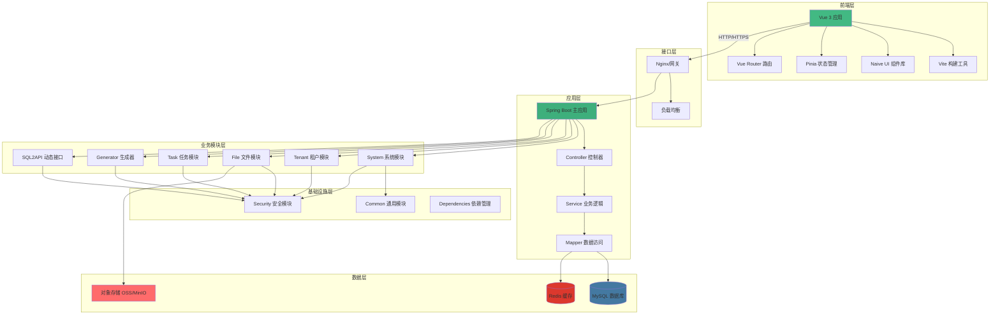

## 分层架构详解

### 1. 前端层（Presentation Layer）

前端层负责用户界面展示和交互逻辑，采用 Vue 3 生态体系。

#### 核心技术栈

| 技术 | 版本 | 作用 |
|------|------|------|
| Vue 3 | 3.5+ | 渐进式 JavaScript 框架 |
| TypeScript | 5.8+ | 类型安全 |
| Vite | 7.0+ | 快速构建工具 |
| Naive UI | 2.43+ | UI 组件库 |
| Pinia | 3.0+ | 状态管理 |
| Axios | 1.12+ | HTTP 客户端 |

#### 目录结构

```
woodlin-web/
├── src/
│   ├── api/          # API 接口定义
│   ├── assets/       # 静态资源
│   ├── components/   # 公共组件
│   ├── layouts/      # 布局组件
│   ├── router/       # 路由配置
│   ├── stores/       # Pinia 状态管理
│   ├── types/        # TypeScript 类型定义
│   ├── utils/        # 工具函数
│   ├── views/        # 页面组件
│   ├── App.vue       # 根组件
│   └── main.ts       # 入口文件
└── public/           # 公共资源
```

#### 数据流

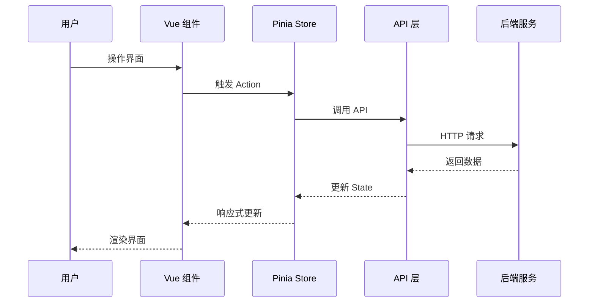

### 2. 接口层（Gateway Layer）

接口层提供统一的入口，负责请求路由、负载均衡、限流等功能。

#### 可选方案

::: code-tabs#gateway

@tab Nginx

```nginx
upstream woodlin_backend {
    server localhost:8080 weight=1;
    server localhost:8081 weight=1;
}

server {
    listen 80;
    server_name woodlin.example.com;
    
    location /api/ {
        proxy_pass http://woodlin_backend;
        proxy_set_header Host $host;
        proxy_set_header X-Real-IP $remote_addr;
    }
    
    location / {
        root /var/www/woodlin-web;
        try_files $uri $uri/ /index.html;
    }
}
```

@tab Spring Cloud Gateway

```yaml
spring:
  cloud:
    gateway:
      routes:
        - id: woodlin-admin
          uri: lb://woodlin-admin
          predicates:
            - Path=/api/**
          filters:
            - StripPrefix=1
            - name: RequestRateLimiter
              args:
                redis-rate-limiter.replenishRate: 100
                redis-rate-limiter.burstCapacity: 200
```

:::

### 3. 应用层（Application Layer）

应用层是 Spring Boot 主应用，负责整合各个功能模块，提供统一的 API 接口。

#### 核心技术栈

| 技术 | 版本 | 作用 |
|------|------|------|
| Spring Boot | 3.4.1 | 应用框架 |
| Spring Web | 3.4.1 | Web MVC 框架 |
| Spring Validation | 3.4.1 | 参数验证 |
| SpringDoc | 2.7.0 | API 文档生成 |

#### 请求处理流程

```mermaid
graph LR
    A[HTTP 请求] --> B[过滤器链]
    B --> C[拦截器]
    C --> D[Controller]
    D --> E[参数验证]
    E --> F[Service]
    F --> G[业务逻辑处理]
    G --> H[Mapper]
    H --> I[数据库操作]
    I --> J[返回结果]
    J --> K[全局异常处理]
    K --> L[统一响应封装]
    L --> M[HTTP 响应]
    
    style A fill:#e1f5ff
    style D fill:#ffe1e1
    style F fill:#fff4e1
    style H fill:#e1ffe1
    style M fill:#f0e1ff
```

### 4. 业务模块层（Business Module Layer）

业务模块层包含各个独立的业务功能模块，每个模块负责特定的业务领域。

#### 模块依赖关系

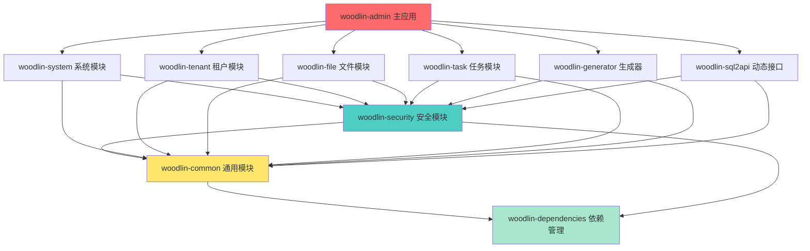

#### 模块职责

| 模块 | 职责 | 核心功能 |
|------|------|----------|
| **woodlin-system** | 系统管理 | 用户、角色、权限、菜单、部门、字典、配置 |
| **woodlin-tenant** | 多租户 | 租户管理、数据隔离、动态数据源 |
| **woodlin-file** | 文件管理 | 文件上传下载、存储管理、在线预览 |
| **woodlin-task** | 任务调度 | 定时任务、Cron 配置、执行日志 |
| **woodlin-generator** | 代码生成 | 数据库逆向、代码模板、全栈生成 |
| **woodlin-sql2api** | 动态接口 | SQL 配置、API 生成、参数验证 |

### 5. 基础设施层（Infrastructure Layer）

基础设施层提供通用的基础能力，被所有业务模块依赖。

#### 模块组成

**woodlin-common（通用模块）**

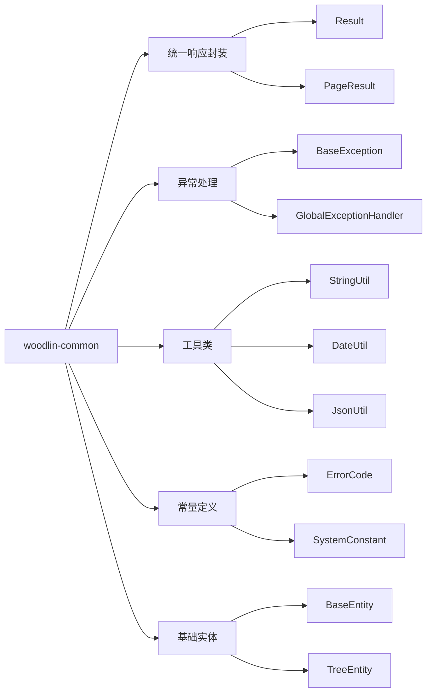

**woodlin-security（安全模块）**

```mermaid
graph LR
    Security[woodlin-security]
    
    Security --> A[认证授权]
    Security --> B[加密解密]
    Security --> C[权限注解]
    
    A --> A1[Sa-Token 集成]
    A --> A2[Token 管理]
    A --> A3[会话管理]
    
    B --> B1[AES 加密]
    B --> B2[RSA 加密]
    B --> B3[SM4 国密]
    
    C --> C1[@RequiresPermission]
    C --> C2[@RequiresRole]
    C --> C3[@RequiresLogin]
```

### 6. 数据层（Data Layer）

数据层负责数据的持久化存储和缓存。

#### 数据存储架构

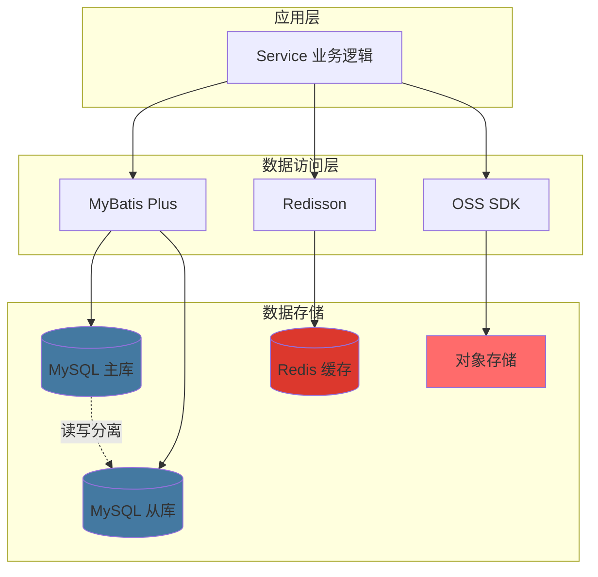

#### 数据库设计

**核心表结构关系**

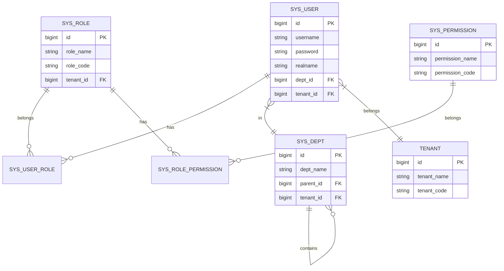

## 核心设计模式

### 1. 多租户数据隔离

Woodlin 采用基于租户 ID 的数据隔离方案：

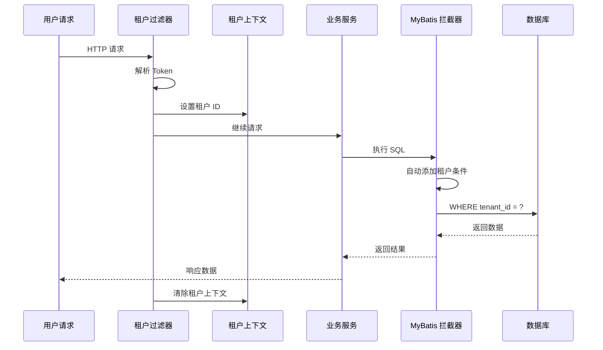

**实现关键代码**

::: code-tabs#java

@tab 租户拦截器

```java
@Component
@Intercepts({
    @Signature(
        type = StatementHandler.class,
        method = "prepare",
        args = {Connection.class, Integer.class}
    )
})
public class TenantInterceptor implements Interceptor {
    
    @Override
    public Object intercept(Invocation invocation) throws Throwable {
        // 获取当前租户 ID
        Long tenantId = TenantContextHolder.getTenantId();
        if (tenantId != null) {
            // 自动添加租户条件
            StatementHandler handler = (StatementHandler) invocation.getTarget();
            BoundSql boundSql = handler.getBoundSql();
            String sql = boundSql.getSql();
            
            // 解析并添加 tenant_id 条件
            sql = addTenantCondition(sql, tenantId);
            
            // 更新 SQL
            setFieldValue(boundSql, "sql", sql);
        }
        return invocation.proceed();
    }
}
```

@tab 租户上下文

```java
public class TenantContextHolder {
    
    private static final ThreadLocal<Long> TENANT_ID = new ThreadLocal<>();
    
    public static void setTenantId(Long tenantId) {
        TENANT_ID.set(tenantId);
    }
    
    public static Long getTenantId() {
        return TENANT_ID.get();
    }
    
    public static void clear() {
        TENANT_ID.remove();
    }
}
```

:::

### 2. RBAC 权限控制

基于角色的访问控制（Role-Based Access Control）实现：

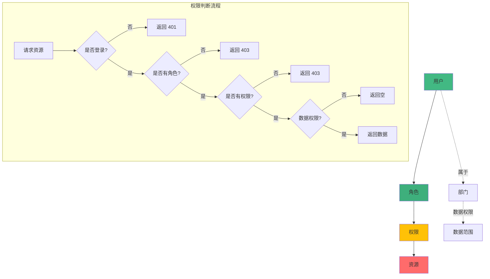

### 3. 缓存策略

采用多级缓存策略提升系统性能：

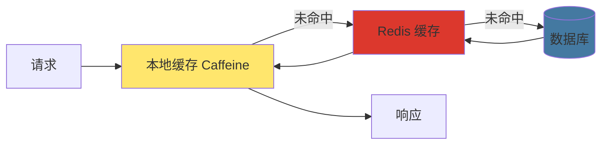

**缓存更新策略**

::: code-tabs#cache

@tab Cache-Aside

```java
// 读取数据
public User getUser(Long id) {
    // 1. 从缓存读取
    User user = redisTemplate.opsForValue().get("user:" + id);
    if (user != null) {
        return user;
    }
    
    // 2. 从数据库读取
    user = userMapper.selectById(id);
    
    // 3. 写入缓存
    if (user != null) {
        redisTemplate.opsForValue().set("user:" + id, user, 1, TimeUnit.HOURS);
    }
    
    return user;
}

// 更新数据
public void updateUser(User user) {
    // 1. 更新数据库
    userMapper.updateById(user);
    
    // 2. 删除缓存
    redisTemplate.delete("user:" + user.getId());
}
```

@tab Write-Through

```java
@CachePut(value = "user", key = "#user.id")
public User updateUser(User user) {
    // 更新数据库，Spring 自动更新缓存
    userMapper.updateById(user);
    return user;
}

@Cacheable(value = "user", key = "#id")
public User getUser(Long id) {
    // Spring 自动管理缓存
    return userMapper.selectById(id);
}
```

:::

## 技术选型原则

### 1. 成熟稳定优先

选择经过生产环境验证的成熟技术：
- ✅ Spring Boot 3.4.1（LTS 版本）
- ✅ MySQL 8.0+（广泛使用）
- ✅ Redis 6.0+（稳定可靠）

### 2. 社区活跃优先

选择社区活跃、文档完善的技术：
- ✅ Vue 3（官方文档完善）
- ✅ MyBatis Plus（中文文档齐全）
- ✅ Naive UI（持续更新）

### 3. 性能优秀优先

选择性能优异的技术方案：
- ✅ Vite（构建速度快）
- ✅ EasyExcel（内存占用低）
- ✅ Redisson（性能优异）

### 4. 易于扩展优先

选择易于扩展的架构设计：
- ✅ 模块化设计
- ✅ 插件化架构
- ✅ 可配置化

## 性能优化策略

### 1. 数据库优化

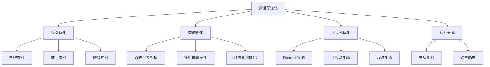

### 2. 缓存优化

- **热点数据缓存**：用户信息、配置信息、字典数据
- **缓存预热**：系统启动时加载常用数据
- **缓存降级**：缓存失效时降级到数据库

### 3. 异步处理

```java
@Async
public CompletableFuture<Void> sendNotification(Long userId, String message) {
    // 异步发送通知，不阻塞主流程
    notificationService.send(userId, message);
    return CompletableFuture.completedFuture(null);
}
```

## 安全架构

### 安全防护体系

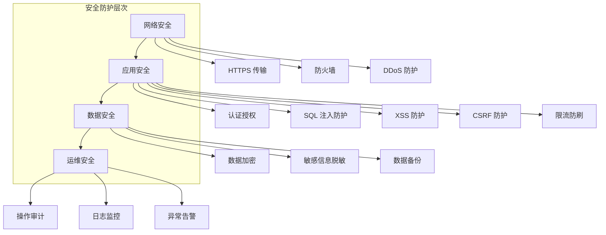

## 总结

Woodlin 的技术架构具有以下特点：

1. **分层清晰**：前后端分离，模块化设计
2. **高可扩展**：插件化架构，易于扩展新功能
3. **高性能**：多级缓存，异步处理，数据库优化
4. **高安全**：完善的安全防护体系
5. **易维护**：统一的代码规范，完整的文档

---

::: tip 相关文档
- [模块总览](/modules/overview) - 了解各个模块的详细功能
- [开发指南](/development/code-style) - 学习开发规范和最佳实践
- [部署指南](/deployment/overview) - 了解部署方案和配置
:::
