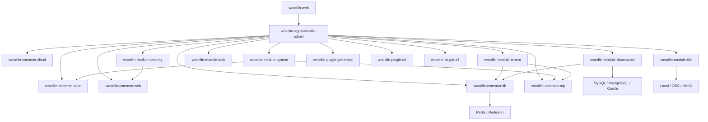
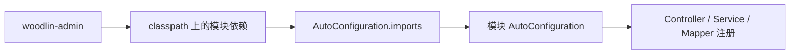
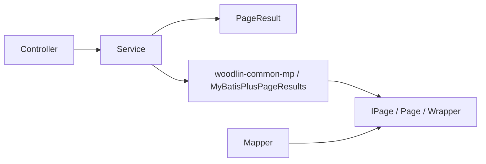

# 技术架构

本文档描述 Woodlin 当前的后端组织方式。重构后的核心目标不是“立刻上微服务”，而是先把单体跑顺，同时把模块边界和装配方式改成未来可拆的形态。

## 总体思路

Woodlin 当前采用：

- 一个单体运行入口：`woodlin-apps/woodlin-admin`
- 一组基础能力模块：`woodlin-common-*`
- 一组主业务模块：`woodlin-modules/*`
- 一组可选插件模块：`woodlin-plugins/*`
- 一个独立前端：`woodlin-web`

整体关系如下：


```mermaid
graph TB
    Web["woodlin-web"] --> Admin["woodlin-apps/woodlin-admin"]

    Admin --> CommonCore["woodlin-common-core"]
    Admin --> CommonWeb["woodlin-common-web"]
    Admin --> CommonDb["woodlin-common-db"]
    Admin --> CommonMp["woodlin-common-mp"]
    Admin --> CommonCloud["woodlin-common-cloud"]

    Admin --> Security["woodlin-module-security"]
    Admin --> System["woodlin-module-system"]
    Admin --> Tenant["woodlin-module-tenant"]
    Admin --> File["woodlin-module-file"]
    Admin --> Task["woodlin-module-task"]
    Admin --> Datasource["woodlin-module-datasource"]

    Admin --> Generator["woodlin-plugin-generator"]
    Admin --> Etl["woodlin-plugin-etl"]
    Admin --> Z3["woodlin-plugin-z3"]

    System --> CommonCore
    Security --> CommonWeb
    Tenant --> CommonDb
    Datasource --> CommonDb
    System --> CommonMp
    Tenant --> CommonMp

    Datasource --> Mysql["MySQL / PostgreSQL / Oracle"]
    CommonDb --> Redis["Redis / Redisson"]
    File --> Storage["Local / OSS / MinIO"]
```

## 聚合器划分

## `woodlin-dependencies`

统一依赖版本，当前基线已经升级到：

- Spring Boot 3.5.12
- Spring Cloud 2025.0.1
- Spring Cloud Alibaba 2025.0.0.0
- MyBatis-Plus 3.5.16
- Sa-Token 1.44.0

## `woodlin-common`

`common` 不再是一个“大杂烩”模块，而是拆成五个边界清晰的子模块：

| 模块 | 职责 |
|------|------|
| `woodlin-common-core` | 常量、异常、统一响应、基础 DTO/VO、工具类 |
| `woodlin-common-web` | MVC、Jackson、全局异常、OpenAPI、BuildInfo |
| `woodlin-common-db` | Redis、分页模型、数据库工具、数据源 SPI |
| `woodlin-common-mp` | MyBatis-Plus 配置、分页适配、字段填充 |
| `woodlin-common-cloud` | Nacos、Snowflake、分布式租约/锁 |

这一步的核心价值是把业务从 `common` 里清出去。例如字典相关 Controller / Service / Mapper / Entity 已经归并到 `woodlin-module-system`。

## `woodlin-modules`

主业务能力集中在 `woodlin-modules`：

- `woodlin-module-security`
- `woodlin-module-system`
- `woodlin-module-tenant`
- `woodlin-module-file`
- `woodlin-module-task`
- `woodlin-module-datasource`

这些模块默认都是“单体可直接装配、以后也可拆出去”的代码单元。

## `woodlin-plugins`

插件能力集中在：

- `woodlin-plugin-generator`
- `woodlin-plugin-etl`
- `woodlin-plugin-sql2api`
- `woodlin-plugin-dsl`
- `woodlin-plugin-z3`

它们默认是可选能力，不要求所有 app 入口都引用。

## `woodlin-apps`

`woodlin-apps/woodlin-admin` 是当前唯一运行入口。  
这个模块现在只做三件事：

1. 提供 Spring Boot 启动类。
2. 聚合需要加载的 `common`、`modules`、`plugins` 依赖。
3. 承载主数据源 Druid 和运行时 Web 配置。

## 模块内分层

业务模块与插件模块统一采用传统层次，不使用 `infrastructure`：

```text
controller/
service/
service/impl/
mapper/
model/entity
model/dto
model/vo
model/query
config/
convert/
```

对应原则：

- `controller` 只负责 HTTP 边界
- `service` 是业务编排与跨模块调用边界
- `mapper` 只在本模块内部可见
- `convert` 统一做对象映射

这种结构仍然是典型单体开发习惯，但边界已经足够清晰，后续拆服务时不需要再先做一次大规模目录治理。

## 单体装配机制

过去 `woodlin-admin` 通过全局扫包和全局 `@MapperScan` 把所有模块扫进来，这会让 app 和业务模块强耦合。  
现在改为模块自注册：


```mermaid
graph LR
    App["woodlin-admin"] --> Classpath["classpath 上的模块依赖"]
    Classpath --> Imports["AutoConfiguration.imports"]
    Imports --> ModuleConfig["模块 AutoConfiguration"]
    ModuleConfig --> Beans["Controller / Service / Mapper 注册"]
```

每个模块负责自己的：

- `@ComponentScan`
- `@MapperScan(basePackageClasses = ...)`
- `@Import`

因此新增一个新 app 时，只要声明依赖即可复用相同模块。

## 数据访问架构

## 主链路连接池

主业务数据源与 `dynamic-datasource` 的 `master` 固定使用 Druid：

- 统一监控入口 `/druid/*`
- 运行时配置留在 `woodlin-admin`
- 方便运维查看核心库连接情况

## 子模块连接池

外部库探测、元数据提取、SQL2API 目标库等短生命周期连接保留 HikariCP：

- `woodlin-module-datasource`
- `woodlin-plugin-sql2api`
- `woodlin-plugin-etl`

这样做的原因是这些连接池由模块内部程序化创建，追求创建快、释放明确，而不是接入主业务池的运维监控体系。

## ORM 策略

当前主 ORM 固定为 MyBatis-Plus，不并行引入 MyBatis-Flex。  
但已做了两层切换预留：

1. 上层服务和控制器统一对外返回 `PageResult`，不再暴露 `IPage`。
2. MP 专属代码收口到 `woodlin-common-mp`。

现在的依赖边界如下：


```mermaid
graph LR
    Controller["Controller"] --> Service["Service"]
    Service --> PageResult["PageResult"]
    Service --> MpAdapter["woodlin-common-mp / MyBatisPlusPageResults"]
    MpAdapter --> IPage["IPage / Page / Wrapper"]
    Mapper["Mapper"] --> IPage
```

这意味着未来如果真的迁移 MyBatis-Flex，主要改动会集中在：

- 实体注解
- `ServiceImpl` 基类能力
- Wrapper 查询构造
- 分页适配
- 自动填充、逻辑删除、乐观锁

结论仍然是：切换成本中等偏大，不建议现在做双支持。

## 为什么这种结构更适合以后拆服务

假设未来要拆出一个系统服务或文件服务：

- 新增 `woodlin-apps/woodlin-app-system` 或 `woodlin-apps/woodlin-app-file`
- 引用对应 `woodlin-module-*` 和必要的 `woodlin-common-*`
- 保持原业务模块代码不变

因此“拆服务”的成本主要在 app 入口、路由、部署和外部依赖，而不是重新整理模块内部代码。

## 架构约束

当前仓库遵循以下硬约束：

1. `common-*` 不放业务 Controller / Mapper / 业务表实体。
2. `woodlin-admin` 不负责全局扫包。
3. MyBatis-Plus 专属配置不得回流到 `woodlin-common-core` 和 `woodlin-common-web`。
4. 主数据源统一 Druid，子模块短连接池统一 HikariCP。

## 总结

Woodlin 当前不是“已经微服务化”的项目，而是“面向未来可拆分的单体”。  
这套结构保留了单体开发效率，同时把公共能力、业务能力、插件能力和运行入口分开，后续无论继续维持单体，还是逐步拆分服务，都不会再被原先那种全局扫包和公共模块混业务的结构拖住。

::: tip
如果要继续扩展仓库，优先新增模块或新增 app，而不是回到 `woodlin-admin` 或 `woodlin-common` 里堆业务代码。
:::
