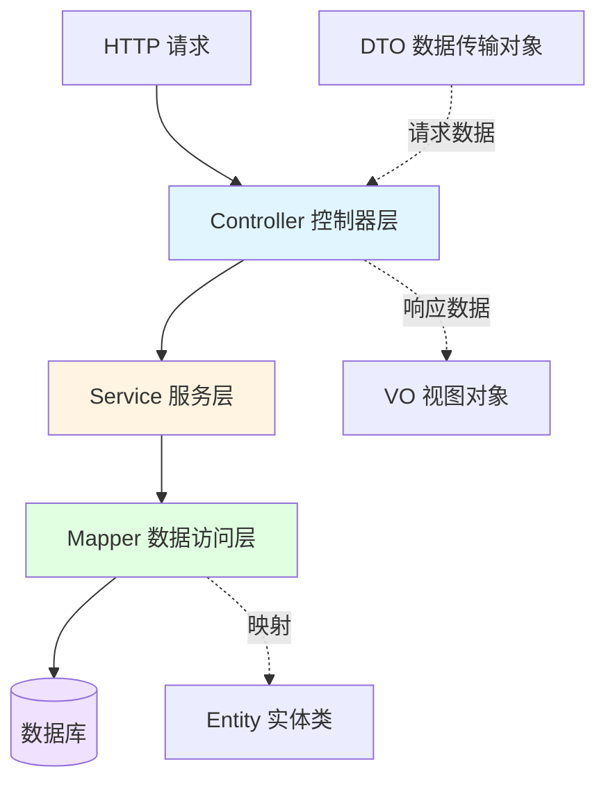
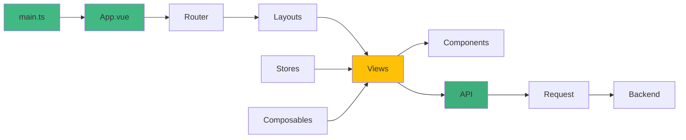

# 目录结构

本文档详细介绍 Woodlin 项目的目录结构，帮助您快速了解项目组织方式和各个目录的作用。

## 项目根目录

```
woodlin/
├── documentation/              # 项目文档（VuePress）
├── scripts/                    # 构建和部署脚本
├── sql/                        # 数据库脚本
├── woodlin-admin/              # Spring Boot 主应用
├── woodlin-common/             # 通用模块
├── woodlin-dependencies/       # 依赖管理模块
├── woodlin-file/               # 文件管理模块
├── woodlin-generator/          # 代码生成模块
├── woodlin-security/           # 安全认证模块
├── woodlin-sql2api/            # SQL2API 动态接口模块
├── woodlin-system/             # 系统管理模块
├── woodlin-task/               # 任务调度模块
├── woodlin-tenant/             # 多租户模块
├── woodlin-web/                # Vue 3 前端应用
├── .editorconfig               # 编辑器配置
├── .env.example                # 环境变量模板
├── .gitignore                  # Git 忽略配置
├── docker-compose.yml          # Docker Compose 配置
├── LICENSE                     # 开源许可证
├── pom.xml                     # Maven 父 POM
└── README.md                   # 项目说明
```

## 后端模块结构

### woodlin-admin（主应用模块）

```
woodlin-admin/
├── src/
│   ├── main/
│   │   ├── java/
│   │   │   └── com/mumu/woodlin/
│   │   │       ├── WoodlinApplication.java    # 应用入口
│   │   │       ├── config/                    # 配置类
│   │   │       │   ├── CorsConfig.java        # 跨域配置
│   │   │       │   ├── DruidConfig.java       # Druid 配置
│   │   │       │   ├── JacksonConfig.java     # Jackson 配置
│   │   │       │   ├── MybatisPlusConfig.java # MyBatis Plus 配置
│   │   │       │   ├── RedisConfig.java       # Redis 配置
│   │   │       │   └── SwaggerConfig.java     # Swagger 配置
│   │   │       └── controller/                # 控制器（可选）
│   │   └── resources/
│   │       ├── application.yml                # 主配置文件
│   │       ├── application-dev.yml            # 开发环境配置
│   │       ├── application-prod.yml           # 生产环境配置
│   │       ├── application-test.yml           # 测试环境配置
│   │       ├── banner.txt                     # 启动横幅
│   │       ├── logback-spring.xml             # 日志配置
│   │       └── static/                        # 静态资源
│   └── test/
│       └── java/                              # 测试代码
└── pom.xml                                    # Maven 配置
```

**关键文件说明**：

::: tabs

@tab WoodlinApplication.java

```java
/**
 * Spring Boot 主应用程序入口
 */
@SpringBootApplication
@EnableScheduling
@MapperScan("com.mumu.woodlin.*.mapper")
public class WoodlinApplication {
    public static void main(String[] args) {
        SpringApplication.run(WoodlinApplication.class, args);
    }
}
```

@tab application.yml

```yaml
# Spring Boot 配置
spring:
  application:
    name: woodlin-admin
  profiles:
    active: dev
    include:
      - system
      - security
      - tenant
      - file
      - task
      - generator
      - sql2api
```

:::

### woodlin-system（系统管理模块）

```
woodlin-system/
├── src/
│   ├── main/
│   │   ├── java/com/mumu/woodlin/system/
│   │   │   ├── controller/               # 控制器层
│   │   │   │   ├── UserController.java
│   │   │   │   ├── RoleController.java
│   │   │   │   ├── PermissionController.java
│   │   │   │   ├── MenuController.java
│   │   │   │   ├── DeptController.java
│   │   │   │   ├── DictController.java
│   │   │   │   └── ConfigController.java
│   │   │   ├── service/                  # 服务层接口
│   │   │   │   ├── UserService.java
│   │   │   │   ├── RoleService.java
│   │   │   │   └── ...
│   │   │   ├── service/impl/             # 服务层实现
│   │   │   │   ├── UserServiceImpl.java
│   │   │   │   ├── RoleServiceImpl.java
│   │   │   │   └── ...
│   │   │   ├── mapper/                   # 数据访问层
│   │   │   │   ├── UserMapper.java
│   │   │   │   ├── RoleMapper.java
│   │   │   │   └── ...
│   │   │   ├── entity/                   # 实体类
│   │   │   │   ├── User.java
│   │   │   │   ├── Role.java
│   │   │   │   └── ...
│   │   │   ├── dto/                      # 数据传输对象
│   │   │   │   ├── UserDTO.java
│   │   │   │   ├── RoleDTO.java
│   │   │   │   └── ...
│   │   │   ├── vo/                       # 视图对象
│   │   │   │   ├── UserVO.java
│   │   │   │   ├── RoleVO.java
│   │   │   │   └── ...
│   │   │   └── enums/                    # 枚举类
│   │   │       ├── UserStatus.java
│   │   │       └── ...
│   │   └── resources/
│   │       ├── mapper/                   # MyBatis XML 文件
│   │       │   ├── UserMapper.xml
│   │       │   ├── RoleMapper.xml
│   │       │   └── ...
│   │       └── application-system.yml    # 模块配置
│   └── test/
│       └── java/                         # 测试代码
└── pom.xml
```

**目录职责说明**：



| 层级 | 目录 | 职责 | 命名规范 |
|------|------|------|----------|
| **Controller** | `controller/` | 接收 HTTP 请求，调用 Service | `XxxController.java` |
| **Service** | `service/` | 业务逻辑处理 | `XxxService.java` (接口)<br>`XxxServiceImpl.java` (实现) |
| **Mapper** | `mapper/` | 数据库操作 | `XxxMapper.java` (接口)<br>`XxxMapper.xml` (XML) |
| **Entity** | `entity/` | 数据库表映射 | `Xxx.java` |
| **DTO** | `dto/` | 接收请求参数 | `XxxDTO.java` |
| **VO** | `vo/` | 返回响应数据 | `XxxVO.java` |
| **Enum** | `enums/` | 枚举常量 | `XxxEnum.java` |

### woodlin-common（通用模块）

```
woodlin-common/
├── src/main/java/com/mumu/woodlin/common/
│   ├── annotation/            # 自定义注解
│   │   ├── Log.java           # 日志注解
│   │   ├── Permission.java    # 权限注解
│   │   └── TenantIgnore.java  # 租户忽略注解
│   ├── aspect/                # 切面
│   │   ├── LogAspect.java     # 日志切面
│   │   └── PermissionAspect.java  # 权限切面
│   ├── config/                # 配置类
│   │   ├── CommonConfig.java
│   │   └── ...
│   ├── constant/              # 常量定义
│   │   ├── ErrorCode.java     # 错误码
│   │   ├── SystemConstant.java # 系统常量
│   │   └── ...
│   ├── domain/                # 通用实体
│   │   ├── BaseEntity.java    # 基础实体
│   │   ├── TreeEntity.java    # 树形实体
│   │   └── PageParam.java     # 分页参数
│   ├── exception/             # 异常定义
│   │   ├── BaseException.java
│   │   ├── BusinessException.java
│   │   ├── GlobalExceptionHandler.java
│   │   └── ...
│   ├── response/              # 响应封装
│   │   ├── Result.java        # 统一响应
│   │   └── PageResult.java    # 分页响应
│   └── util/                  # 工具类
│       ├── StringUtil.java
│       ├── DateUtil.java
│       ├── JsonUtil.java
│       ├── TreeUtil.java
│       └── ...
└── pom.xml
```

### 其他业务模块

所有业务模块（tenant、file、task、generator、sql2api）均遵循相同的目录结构：

```
woodlin-{module}/
├── src/
│   ├── main/
│   │   ├── java/com/mumu/woodlin/{module}/
│   │   │   ├── controller/
│   │   │   ├── service/
│   │   │   ├── service/impl/
│   │   │   ├── mapper/
│   │   │   ├── entity/
│   │   │   ├── dto/
│   │   │   ├── vo/
│   │   │   ├── config/
│   │   │   └── util/
│   │   └── resources/
│   │       ├── mapper/
│   │       └── application-{module}.yml
│   └── test/
└── pom.xml
```

## 前端目录结构

### woodlin-web（Vue 3 应用）

```
woodlin-web/
├── public/                     # 公共资源
│   ├── favicon.ico
│   └── logo.svg
├── src/
│   ├── api/                    # API 接口定义
│   │   ├── auth.ts             # 认证接口
│   │   ├── user.ts             # 用户接口
│   │   ├── role.ts             # 角色接口
│   │   ├── tenant.ts           # 租户接口
│   │   ├── file.ts             # 文件接口
│   │   └── ...
│   ├── assets/                 # 静态资源
│   │   ├── images/             # 图片
│   │   ├── styles/             # 全局样式
│   │   │   ├── index.scss      # 主样式文件
│   │   │   ├── variables.scss  # SCSS 变量
│   │   │   └── mixins.scss     # SCSS 混入
│   │   └── icons/              # 图标
│   ├── components/             # 公共组件
│   │   ├── common/             # 通用组件
│   │   │   ├── AppHeader.vue
│   │   │   ├── AppSidebar.vue
│   │   │   ├── AppBreadcrumb.vue
│   │   │   └── ...
│   │   ├── table/              # 表格组件
│   │   │   ├── DataTable.vue
│   │   │   └── ...
│   │   └── form/               # 表单组件
│   │       ├── FormItem.vue
│   │       └── ...
│   ├── composables/            # 组合式函数
│   │   ├── useTable.ts         # 表格逻辑
│   │   ├── useForm.ts          # 表单逻辑
│   │   ├── useAuth.ts          # 认证逻辑
│   │   └── ...
│   ├── layouts/                # 布局组件
│   │   ├── DefaultLayout.vue   # 默认布局
│   │   ├── BlankLayout.vue     # 空白布局
│   │   └── ...
│   ├── router/                 # 路由配置
│   │   ├── index.ts            # 路由主文件
│   │   ├── routes.ts           # 路由定义
│   │   └── guards.ts           # 路由守卫
│   ├── stores/                 # Pinia 状态管理
│   │   ├── auth.ts             # 认证状态
│   │   ├── user.ts             # 用户状态
│   │   ├── app.ts              # 应用状态
│   │   └── ...
│   ├── types/                  # TypeScript 类型定义
│   │   ├── api.d.ts            # API 类型
│   │   ├── user.d.ts           # 用户类型
│   │   ├── role.d.ts           # 角色类型
│   │   └── ...
│   ├── utils/                  # 工具函数
│   │   ├── request.ts          # HTTP 请求封装
│   │   ├── storage.ts          # 本地存储封装
│   │   ├── format.ts           # 格式化工具
│   │   └── ...
│   ├── views/                  # 页面组件
│   │   ├── auth/               # 认证页面
│   │   │   ├── Login.vue
│   │   │   └── Register.vue
│   │   ├── system/             # 系统管理
│   │   │   ├── user/           # 用户管理
│   │   │   │   ├── UserList.vue
│   │   │   │   └── UserForm.vue
│   │   │   ├── role/           # 角色管理
│   │   │   └── ...
│   │   ├── tenant/             # 租户管理
│   │   ├── file/               # 文件管理
│   │   └── ...
│   ├── App.vue                 # 根组件
│   ├── main.ts                 # 入口文件
│   └── vite-env.d.ts           # Vite 类型声明
├── .env                        # 环境变量
├── .env.development            # 开发环境变量
├── .env.production             # 生产环境变量
├── .eslintrc.cjs               # ESLint 配置
├── .prettierrc.json            # Prettier 配置
├── index.html                  # HTML 模板
├── package.json                # npm 配置
├── tsconfig.json               # TypeScript 配置
├── vite.config.ts              # Vite 配置
└── README.md
```

**前端目录职责**：



| 目录 | 职责 | 示例 |
|------|------|------|
| **api/** | API 接口定义 | `getUserList()`, `createUser()` |
| **components/** | 可复用组件 | `<DataTable>`, `<FormItem>` |
| **composables/** | 组合式函数 | `useTable()`, `useAuth()` |
| **layouts/** | 页面布局 | `<DefaultLayout>` |
| **router/** | 路由管理 | 路由配置、导航守卫 |
| **stores/** | 状态管理 | Pinia Store |
| **types/** | 类型定义 | TypeScript 接口 |
| **utils/** | 工具函数 | 请求封装、格式化 |
| **views/** | 页面组件 | 业务页面 |

## 文档目录

### documentation（VuePress 文档）

```
documentation/
├── docs/
│   ├── .vuepress/
│   │   ├── config.ts           # VuePress 配置
│   │   ├── client.ts           # 客户端配置
│   │   ├── styles/             # 自定义样式
│   │   │   └── index.scss
│   │   └── public/             # 静态资源
│   │       ├── logo.svg
│   │       └── favicon.ico
│   ├── api/                    # API 文档
│   │   ├── overview.md
│   │   ├── authentication.md
│   │   └── ...
│   ├── deployment/             # 部署文档
│   │   ├── overview.md
│   │   ├── docker.md
│   │   └── ...
│   ├── development/            # 开发文档
│   │   ├── code-style.md
│   │   ├── testing.md
│   │   └── ...
│   ├── guide/                  # 指南文档
│   │   ├── introduction.md
│   │   ├── getting-started.md
│   │   ├── architecture.md
│   │   └── ...
│   ├── modules/                # 模块文档
│   │   ├── overview.md
│   │   ├── common.md
│   │   └── ...
│   └── index.md                # 首页
├── package.json
└── README.md
```

## 脚本目录

### scripts（构建和部署脚本）

```
scripts/
├── dev.sh                      # 开发脚本
├── deploy.sh                   # 部署脚本
├── Dockerfile                  # Docker 镜像构建文件
└── docker-entrypoint.sh        # Docker 入口脚本
```

## 数据库脚本

### sql（数据库脚本）

```
sql/
├── woodlin_schema.sql          # 数据库结构
├── woodlin_data.sql            # 初始数据
└── upgrade/                    # 升级脚本
    ├── v1.0.0_to_v1.1.0.sql
    └── ...
```

## 配置文件

### 根目录配置文件

| 文件 | 作用 |
|------|------|
| **pom.xml** | Maven 父 POM，定义项目结构和依赖管理 |
| **docker-compose.yml** | Docker Compose 配置，定义服务编排 |
| **.env.example** | 环境变量模板 |
| **.gitignore** | Git 忽略配置 |
| **.editorconfig** | 编辑器配置 |
| **LICENSE** | 开源许可证 |
| **README.md** | 项目说明 |

## 目录命名规范

### Java 模块命名

```
woodlin-{module}/
```

- 全小写
- 连字符分隔
- 模块名简洁明了

### 包命名

```java
com.mumu.woodlin.{module}.{layer}
```

- 全小写
- 点号分隔
- 层级清晰

### 文件命名

| 类型 | 规范 | 示例 |
|------|------|------|
| Controller | `XxxController.java` | `UserController.java` |
| Service | `XxxService.java` | `UserService.java` |
| ServiceImpl | `XxxServiceImpl.java` | `UserServiceImpl.java` |
| Mapper | `XxxMapper.java` | `UserMapper.java` |
| Entity | `Xxx.java` | `User.java` |
| DTO | `XxxDTO.java` | `UserDTO.java` |
| VO | `XxxVO.java` | `UserVO.java` |
| Enum | `XxxEnum.java` | `UserStatus.java` |
| Config | `XxxConfig.java` | `RedisConfig.java` |
| Util | `XxxUtil.java` | `StringUtil.java` |

### Vue 文件命名

| 类型 | 规范 | 示例 |
|------|------|------|
| 页面组件 | 大驼峰 | `UserList.vue` |
| 公共组件 | 大驼峰 | `DataTable.vue` |
| TypeScript | 小驼峰 | `userApi.ts` |
| 类型定义 | 小驼峰 | `userTypes.ts` |

## 总结

Woodlin 项目采用清晰的目录结构：

1. **后端模块化**：每个模块独立，职责清晰
2. **前端组件化**：组件复用，逻辑分离
3. **分层架构**：Controller → Service → Mapper，各司其职
4. **规范命名**：统一的命名规范，易于理解

---

::: tip 最佳实践
- 保持目录结构的一致性
- 遵循单一职责原则
- 合理组织代码层次
- 及时更新文档
:::

::: info 相关文档
- [技术架构](/guide/architecture) - 了解系统架构设计
- [代码规范](/development/code-style) - 学习编码规范
- [开发指南](/development/environment-setup) - 配置开发环境
:::
