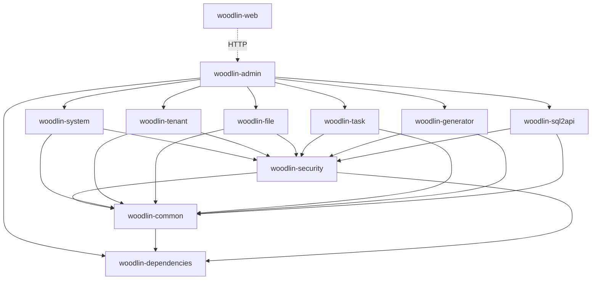

# 模块总览

Woodlin 采用模块化的架构设计，每个模块职责清晰、相互解耦、高内聚低耦合。本页面提供所有模块的总览信息。

## 模块架构图

```
woodlin (根模块)
├── woodlin-dependencies     # BOM 依赖管理模块
├── woodlin-common          # 通用基础模块
├── woodlin-security        # 安全认证模块
├── woodlin-system          # 系统管理模块
├── woodlin-tenant          # 多租户模块
├── woodlin-file            # 文件管理模块
├── woodlin-task            # 任务调度模块
├── woodlin-generator       # 代码生成模块
├── woodlin-sql2api         # SQL2API 动态接口模块
├── woodlin-admin           # Spring Boot 主应用模块
└── woodlin-web             # Vue 3 前端模块
```

## 模块分类

### 基础设施模块

这些模块提供基础功能和工具，被其他业务模块依赖。

| 模块 | 说明 | Maven 坐标 | 主要功能 |
|------|------|-----------|----------|
| [**woodlin-dependencies**](./dependencies) | 依赖管理 | `com.mumu:woodlin-dependencies:1.0.0` | 统一管理所有第三方依赖版本 |
| [**woodlin-common**](./common) | 通用模块 | `com.mumu:woodlin-common:1.0.0` | 通用工具类、常量、异常、响应封装 |
| [**woodlin-security**](./security) | 安全模块 | `com.mumu:woodlin-security:1.0.0` | 认证授权、加密解密、权限控制 |

### 业务功能模块

这些模块实现具体的业务功能，可以根据需要选择性使用。

| 模块 | 说明 | Maven 坐标 | 主要功能 |
|------|------|-----------|----------|
| [**woodlin-system**](./system) | 系统管理 | `com.mumu:woodlin-system:1.0.0` | 用户、角色、权限、部门、菜单管理 |
| [**woodlin-tenant**](./tenant) | 多租户 | `com.mumu:woodlin-tenant:1.0.0` | 租户管理、数据隔离、动态数据源 |
| [**woodlin-file**](./file) | 文件管理 | `com.mumu:woodlin-file:1.0.0` | 文件上传下载、多存储支持、预览 |
| [**woodlin-task**](./task) | 任务调度 | `com.mumu:woodlin-task:1.0.0` | 定时任务、Cron 表达式、执行日志 |
| [**woodlin-generator**](./generator) | 代码生成 | `com.mumu:woodlin-generator:1.0.0` | 数据库逆向、代码模板、全栈生成 |
| [**woodlin-sql2api**](./sql2api) | SQL2API | `com.mumu:woodlin-sql2api:1.0.0` | SQL 转 API、动态接口、参数验证 |

### 应用模块

应用模块是系统的入口和界面。

| 模块 | 说明 | 技术栈 | 主要功能 |
|------|------|--------|----------|
| [**woodlin-admin**](./admin) | 管理后台 | Spring Boot 3.4.1 | 主应用程序、API 入口、配置管理 |
| [**woodlin-web**](./web) | 前端应用 | Vue 3.5 + TypeScript + Naive UI | 用户界面、交互逻辑、页面展示 |

## 模块依赖关系



**依赖关系说明**：

- **woodlin-dependencies**：被所有模块依赖，统一管理版本
- **woodlin-common**：被所有业务模块依赖，提供通用功能
- **woodlin-security**：被需要认证授权的模块依赖
- **woodlin-admin**：聚合所有功能模块，作为主应用入口
- **woodlin-web**：通过 HTTP 调用后端 API

## 模块详细信息

### woodlin-dependencies（依赖管理模块）

**作用**：统一管理所有第三方依赖的版本，确保依赖版本一致性。

**关键依赖**：
- Spring Boot 3.4.1
- MyBatis Plus 3.5.9
- Sa-Token 1.39.0
- Hutool 5.8.34
- 等...

**使用方式**：

```xml
<dependencyManagement>
    <dependencies>
        <dependency>
            <groupId>com.mumu</groupId>
            <artifactId>woodlin-dependencies</artifactId>
            <version>1.0.0</version>
            <type>pom</type>
            <scope>import</scope>
        </dependency>
    </dependencies>
</dependencyManagement>
```

[查看详细文档](./dependencies)

### woodlin-common（通用模块）

**作用**：提供通用的工具类、常量定义、异常处理、响应封装等基础功能。

**核心组件**：
- `Result<T>`：统一响应封装
- `BaseException`：自定义异常基类
- `GlobalExceptionHandler`：全局异常处理器
- `StringUtil`、`DateUtil` 等工具类
- `SystemConstant`、`ErrorCode` 等常量定义

**包结构**：
```
com.mumu.woodlin.common
├── annotation      # 自定义注解
├── config         # 公共配置
├── constant       # 常量定义
├── domain         # 通用实体
├── exception      # 异常定义
├── response       # 响应封装
└── util           # 工具类
```

[查看详细文档](./common)

### woodlin-security（安全认证模块）

**作用**：提供统一的认证授权、加密解密、权限控制功能。

**核心功能**：
- 用户认证（登录、登出）
- Token 管理（生成、验证、刷新）
- 权限注解（`@RequiresPermission`、`@RequiresRole`）
- 加密解密（AES、RSA、SM4）
- 密码策略管理

**技术实现**：基于 Sa-Token 实现

[查看详细文档](./security)

### woodlin-system（系统管理模块）

**作用**：实现系统的核心管理功能。

**核心功能**：
- **用户管理**：用户增删改查、密码管理、状态管理
- **角色管理**：角色定义、权限分配、数据权限
- **权限管理**：权限定义、权限树、权限分配
- **菜单管理**：菜单配置、动态菜单、菜单权限
- **部门管理**：部门树、部门层级、部门权限
- **字典管理**：数据字典、字典项、字典缓存
- **配置管理**：系统配置、参数配置、配置热更新
- **操作日志**：操作记录、审计日志、日志查询

**数据库表**：
- `sys_user`：用户表
- `sys_role`：角色表
- `sys_permission`：权限表
- `sys_menu`：菜单表
- `sys_dept`：部门表
- `sys_dict`：字典表
- `sys_config`：配置表
- `sys_log`：日志表

[查看详细文档](./system)

### woodlin-tenant（多租户模块）

**作用**：实现多租户架构，提供租户管理和数据隔离功能。

**核心功能**：
- **租户管理**：租户创建、编辑、启用/禁用
- **数据隔离**：基于租户 ID 的数据过滤
- **动态数据源**：每个租户可使用独立数据库
- **租户切换**：支持超级管理员切换租户

**实现原理**：
- MyBatis Plus 拦截器自动添加租户条件
- ThreadLocal 存储当前租户上下文
- 动态数据源路由

[查看详细文档](./tenant)

### woodlin-file（文件管理模块）

**作用**：提供文件上传下载、存储管理、在线预览等功能。

**核心功能**：
- **文件上传**：单文件、多文件、分片上传
- **文件下载**：断点续传、批量下载、打包下载
- **存储方式**：本地存储、阿里云 OSS、MinIO
- **在线预览**：图片、PDF、Office 文档预览
- **文件管理**：文件列表、搜索、删除、移动
- **权限控制**：基于权限的文件访问控制

**支持的存储**：
- Local：本地文件系统
- OSS：阿里云对象存储
- MinIO：开源对象存储

[查看详细文档](./file)

### woodlin-task（任务调度模块）

**作用**：提供定时任务调度功能，支持 Cron 表达式和动态任务管理。

**核心功能**：
- **任务定义**：任务配置、Cron 表达式
- **任务管理**：添加、修改、删除、暂停、恢复
- **执行控制**：立即执行、停止执行
- **执行日志**：执行记录、执行状态、错误信息
- **失败重试**：自动重试、重试次数配置
- **并发控制**：任务并发数限制

**技术实现**：基于 Spring Boot + Quartz

[查看详细文档](./task)

### woodlin-generator（代码生成模块）

**作用**：根据数据库表结构自动生成前后端代码。

**核心功能**：
- **数据库逆向**：读取数据库表结构
- **代码生成**：Entity、Mapper、Service、Controller、Vue 页面
- **模板定制**：支持自定义代码模板
- **配置灵活**：字段映射、类型转换、前缀配置
- **批量生成**：支持批量选择表生成

**生成的代码包括**：
- 后端：Entity、Mapper XML、Service、Controller
- 前端：API、表格页面、表单页面、类型定义

[查看详细文档](./generator)

### woodlin-sql2api（SQL2API 模块）

**作用**：通过配置 SQL 语句快速生成 RESTful API。

**核心功能**：
- **SQL 配置**：在界面配置 SQL 和参数
- **动态生成**：自动生成 API 接口
- **参数验证**：类型验证、必填验证、正则验证
- **结果映射**：SQL 结果到 JSON 的映射
- **加密支持**：支持 API 加密配置
- **限流控制**：QPS 限流配置
- **权限认证**：Token、API Key 认证

**适用场景**：
- 快速原型开发
- 简单的查询接口
- 第三方数据接口

[查看详细文档](./sql2api)

### woodlin-admin（管理后台模块）

**作用**：Spring Boot 主应用程序，整合所有功能模块。

**核心职责**：
- 应用程序入口（`@SpringBootApplication`）
- 配置管理（`application.yml`）
- 依赖整合（Maven 依赖）
- API 网关（统一路由前缀 `/api`）

**启动方式**：

```bash
# Maven 启动
mvn spring-boot:run -pl woodlin-admin

# Jar 包启动
java -jar woodlin-admin/target/woodlin-admin-1.0.0.jar
```

[查看详细文档](./admin)

### woodlin-web（前端应用模块）

**作用**：Vue 3 前端应用，提供用户界面和交互。

**技术栈**：
- Vue 3.5 + TypeScript 5.8
- Vite 7.0（构建工具）
- Naive UI 2.43（UI 组件库）
- Pinia 3.0（状态管理）
- Vue Router 4.5（路由）
- Axios 1.12（HTTP 客户端）

**核心功能**：
- 登录认证界面
- 系统管理界面（用户、角色、权限、菜单、部门）
- 租户管理界面
- 文件管理界面
- 任务调度界面
- 代码生成界面
- SQL2API 配置界面

**启动方式**：

```bash
cd woodlin-web
npm install
npm run dev  # 开发模式
npm run build  # 生产构建
```

[查看详细文档](./web)

## 如何选择模块

### 最小化部署

如果您只需要基础的用户权限管理功能：

```xml
<dependencies>
    <!-- 必需的基础模块 -->
    <dependency>
        <groupId>com.mumu</groupId>
        <artifactId>woodlin-common</artifactId>
    </dependency>
    <dependency>
        <groupId>com.mumu</groupId>
        <artifactId>woodlin-security</artifactId>
    </dependency>
    <dependency>
        <groupId>com.mumu</groupId>
        <artifactId>woodlin-system</artifactId>
    </dependency>
</dependencies>
```

### 单租户部署

如果您不需要多租户功能，可以不引入 tenant 模块：

```xml
<dependencies>
    <!-- 基础模块 -->
    <dependency>
        <groupId>com.mumu</groupId>
        <artifactId>woodlin-common</artifactId>
    </dependency>
    <dependency>
        <groupId>com.mumu</groupId>
        <artifactId>woodlin-security</artifactId>
    </dependency>
    <dependency>
        <groupId>com.mumu</groupId>
        <artifactId>woodlin-system</artifactId>
    </dependency>
    
    <!-- 功能模块（按需选择） -->
    <dependency>
        <groupId>com.mumu</groupId>
        <artifactId>woodlin-file</artifactId>
    </dependency>
    <dependency>
        <groupId>com.mumu</groupId>
        <artifactId>woodlin-task</artifactId>
    </dependency>
</dependencies>
```

### 完整部署

包含所有功能模块（默认配置）：

```xml
<dependencies>
    <!-- 所有模块 -->
    <dependency>
        <groupId>com.mumu</groupId>
        <artifactId>woodlin-common</artifactId>
    </dependency>
    <dependency>
        <groupId>com.mumu</groupId>
        <artifactId>woodlin-security</artifactId>
    </dependency>
    <dependency>
        <groupId>com.mumu</groupId>
        <artifactId>woodlin-system</artifactId>
    </dependency>
    <dependency>
        <groupId>com.mumu</groupId>
        <artifactId>woodlin-tenant</artifactId>
    </dependency>
    <dependency>
        <groupId>com.mumu</groupId>
        <artifactId>woodlin-file</artifactId>
    </dependency>
    <dependency>
        <groupId>com.mumu</groupId>
        <artifactId>woodlin-task</artifactId>
    </dependency>
    <dependency>
        <groupId>com.mumu</groupId>
        <artifactId>woodlin-generator</artifactId>
    </dependency>
    <dependency>
        <groupId>com.mumu</groupId>
        <artifactId>woodlin-sql2api</artifactId>
    </dependency>
</dependencies>
```

## 模块开发规范

### 命名规范

- **模块名称**：`woodlin-{功能名称}`（全小写，连字符分隔）
- **包名**：`com.mumu.woodlin.{模块名}`
- **Maven 坐标**：`com.mumu:woodlin-{功能名称}:版本号`

### 目录结构

每个模块遵循标准的 Maven 项目结构：

```
woodlin-{module}
├── src
│   ├── main
│   │   ├── java
│   │   │   └── com
│   │   │       └── mumu
│   │   │           └── woodlin
│   │   │               └── {module}
│   │   │                   ├── controller    # 控制器
│   │   │                   ├── service       # 服务层
│   │   │                   ├── mapper        # 数据访问层
│   │   │                   ├── entity        # 实体类
│   │   │                   ├── dto           # 数据传输对象
│   │   │                   ├── vo            # 视图对象
│   │   │                   ├── config        # 配置类
│   │   │                   └── util          # 工具类
│   │   └── resources
│   │       ├── mapper        # MyBatis XML
│   │       └── application-{module}.yml  # 模块配置
│   └── test
│       └── java
│           └── com
│               └── mumu
│                   └── woodlin
│                       └── {module}
│                           └── {Module}Tests.java
└── pom.xml
```

### 依赖管理

- 所有模块必须依赖 `woodlin-dependencies`
- 通用功能从 `woodlin-common` 获取，不要重复实现
- 需要认证授权的模块依赖 `woodlin-security`
- 模块间依赖要明确，避免循环依赖

### 配置管理

- 每个模块的配置放在 `application-{module}.yml`
- 主应用通过 `spring.profiles.include` 引入模块配置
- 敏感配置使用环境变量或配置中心

## 扩展新模块

如果您需要添加新的功能模块：

1. **创建模块目录**：`woodlin-{your-module}`
2. **配置 pom.xml**：定义依赖和构建配置
3. **实现业务逻辑**：按照目录结构实现功能
4. **编写单元测试**：确保代码质量
5. **添加配置文件**：`application-{your-module}.yml`
6. **更新文档**：添加模块说明文档

详细的扩展开发指南请查看：[自定义模块开发](/development/custom-module)

## 下一步

- 查看具体模块的详细文档，了解每个模块的功能和使用方法
- 查看 [开发指南](/development/code-style) 学习开发规范
- 查看 [API 文档](/api/overview) 了解接口定义

---

::: tip 模块选择建议
- 小型项目：使用基础模块（common + security + system）
- 中型项目：添加需要的功能模块（file、task 等）
- 大型项目：使用完整模块，根据需求定制扩展
- SaaS 平台：必须包含 tenant 模块
:::
