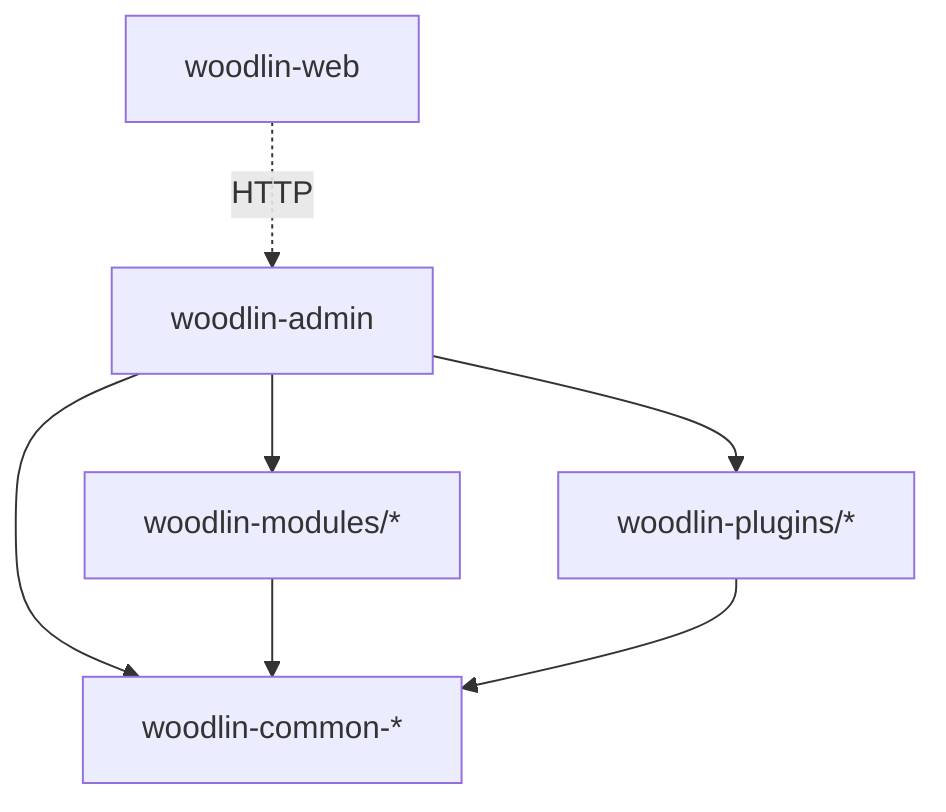
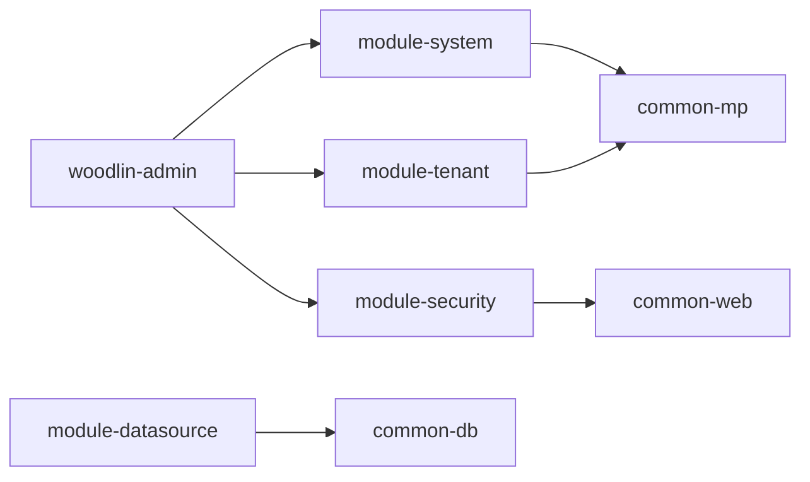

# 模块总览

Woodlin 当前的模块划分已经从旧的“所有模块平铺”调整为四类聚合器：`woodlin-common`、`woodlin-modules`、`woodlin-plugins`、`woodlin-apps`。这样既能维持单体开发体验，也给未来拆服务保留了稳定边界。

## 当前模块树

```text
woodlin
├── woodlin-dependencies
├── woodlin-common
│   ├── woodlin-common-core
│   ├── woodlin-common-web
│   ├── woodlin-common-db
│   ├── woodlin-common-mp
│   └── woodlin-common-cloud
├── woodlin-modules
│   ├── woodlin-module-security
│   ├── woodlin-module-system
│   ├── woodlin-module-tenant
│   ├── woodlin-module-file
│   ├── woodlin-module-task
│   └── woodlin-module-datasource
├── woodlin-plugins
│   ├── woodlin-plugin-generator
│   ├── woodlin-plugin-etl
│   ├── woodlin-plugin-sql2api
│   ├── woodlin-plugin-dsl
│   └── woodlin-plugin-z3
├── woodlin-apps
│   └── woodlin-admin
└── woodlin-web
```

## 模块分类

## 1. 依赖管理

| 模块 | 说明 |
|------|------|
| `woodlin-dependencies` | 统一维护 Spring Boot 3.5.12、Spring Cloud 2025.0.1、MyBatis-Plus 3.5.16、Sa-Token 1.44.0 等版本。 |

## 2. 基础能力

| 模块 | 说明 |
|------|------|
| `woodlin-common-core` | 常量、异常、统一响应、基础 DTO/VO、工具类 |
| `woodlin-common-web` | MVC/Jackson/OpenAPI 公共配置、全局异常、BuildInfo |
| `woodlin-common-db` | Redis、分页模型、DB 工具、数据源 SPI |
| `woodlin-common-mp` | MyBatis-Plus 专属配置、分页适配、字段填充 |
| `woodlin-common-cloud` | Nacos、Snowflake、分布式锁/租约 |

说明：

- `common-*` 只放基础能力
- 不允许继续把业务 Controller / Service / Mapper / 业务表实体放进 `common`

## 3. 主业务模块

| 模块 | 说明 |
|------|------|
| [`woodlin-module-security`](./security) | 认证、鉴权、密码策略、会话能力 |
| [`woodlin-module-system`](./system) | 用户、角色、菜单、字典、系统配置 |
| [`woodlin-module-tenant`](./tenant) | 租户管理与数据隔离 |
| [`woodlin-module-file`](./file) | 文件上传、下载、预览、存储策略 |
| [`woodlin-module-task`](./task) | 任务调度、执行日志 |
| `woodlin-module-datasource` | 外部数据源、元数据提取、数据库适配能力 |

## 4. 插件模块

| 模块 | 说明 |
|------|------|
| [`woodlin-plugin-generator`](./generator) | 代码生成 |
| `woodlin-plugin-etl` | ETL 编排与执行 |
| [`woodlin-plugin-sql2api`](./sql2api) | SQL 转 API |
| `woodlin-plugin-dsl` | DSL 相关能力 |
| `woodlin-plugin-z3` | Z3 相关能力 |

插件模块默认按“可选能力”组织，由 app 入口决定是否打包。

## 5. 应用入口

| 模块 | 说明 |
|------|------|
| [`woodlin-admin`](./admin) | 当前唯一单体入口，位于 `woodlin-apps/woodlin-admin`，负责装配所有需要的 common/module/plugin 依赖与运行时配置。 |
| [`woodlin-web`](./web) | Vue 3 管理端前端。 |

## 依赖关系


```mermaid
graph TB
    Admin["woodlin-admin"] --> Core["woodlin-common-*"]
    Admin --> Modules["woodlin-modules/*"]
    Admin --> Plugins["woodlin-plugins/*"]
    Web["woodlin-web"] -.HTTP.-> Admin

    Modules --> Core
    Plugins --> Core
```

更细一点的后端关系：


```mermaid
graph LR
    System["module-system"] --> Mp["common-mp"]
    Tenant["module-tenant"] --> Mp
    Datasource["module-datasource"] --> Db["common-db"]
    Security["module-security"] --> WebCommon["common-web"]
    Admin["woodlin-admin"] --> System
    Admin --> Tenant
    Admin --> Security
```

## 运行与装配方式

当前所有模块都通过 Spring Boot 自动装配注册自身，而不是由 `woodlin-admin` 全局扫包。  
这意味着：

- `woodlin-admin` 只做运行入口
- 模块通过依赖声明决定是否启用
- 以后新增 `woodlin-app-*` 时可以直接复用同一批模块

## ORM 与分页边界

目前主 ORM 为 MyBatis-Plus，但对外边界已经做了收口：

- Controller / Service 对外返回 `PageResult`
- `IPage` 只在 mapper 或 MP 适配层内部使用
- MyBatis-Plus 专属逻辑集中在 `woodlin-common-mp`

这也是后续如果要迁移 MyBatis-Flex 时最重要的边界之一。

## 模块开发规则

1. 业务模块和插件模块统一使用 `controller / service / mapper / model / config / convert` 分层。
2. 跨模块只能通过 `service` 协作，禁止直接调用其他模块的 `mapper`。
3. 主数据源固定 Druid；元数据提取和临时外部库连接固定 HikariCP。
4. 新增功能时优先考虑放进 `woodlin-modules` 或 `woodlin-plugins`，不要回流到 `woodlin-admin` 或 `woodlin-common-*`。

## 下一步

- 查看 [技术架构](/guide/architecture) 了解整体设计
- 查看 [目录结构](/guide/directory-structure) 了解各目录职责
- 查看各模块页面了解具体业务能力
